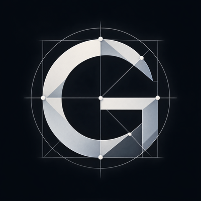

<p align="center"></p>

# Geometra

Librería moderna de geometría computacional en C++20: pequeña, sin dependencias externas,
sin interfaz gráfica y con una API pública que oculta la complejidad de los algoritmos.

```cpp
#include <geometra/geometra.hpp>

std::vector<geo::Point2D> points = {{0, 0}, {4, 0}, {4, 4}, {0, 4}, {2, 2}};
auto hull = geo::convex_hull(points);   // {(0,0), (4,0), (4,4), (0,4)} en sentido antihorario
```

## Objetivo

Ofrecer implementaciones correctas y numéricamente robustas de los algoritmos clásicos de
geometría computacional en el plano, con una API mínima que se pueda integrar en cualquier
proyecto C++20 con una sola línea de CMake.

La visión del proyecto es incorporar progresivamente:

- [x] **Etapa 1**: `Point2D`, predicados geométricos exactos y **Convex Hull**
- [ ] Delaunay Triangulation
- [ ] Voronoi Diagram
- [ ] Poisson Disk Sampling
- [ ] Lloyd Relaxation
- [ ] Alpha Shapes

Estado actual: **etapa 1 completa** (versión 0.1.0).

## Características

- **C++20 estricto**, sin extensiones del compilador y sin dependencias externas (tampoco para
  los tests ni el benchmark).
- **Predicado de orientación exacto** (aritmética adaptativa de Shewchuk): el signo de
  `orientation(a, b, c)` es siempre el correcto, por degenerada que sea la configuración.
  Es la base sobre la que se construirán Delaunay y Voronoi.
- **Convex Hull robusto** en O(n log n) con un contrato de salida preciso, que maneja puntos
  duplicados, colineales y conjuntos de 0, 1 y 2 puntos.
- **API simple**: tipos de valor, funciones libres, `std::span` y `std::vector`. Nada que
  configurar antes de llamar.
- **Integración fácil**: `add_subdirectory`, `FetchContent` o `find_package(geometra)`.

## Compilación

Requisitos: CMake ≥ 3.21 y un compilador con soporte de C++20 (probado con GCC 13.3;
Clang ≥ 15 y MSVC 2022 deberían funcionar).

```bash
git clone https://github.com/valNito/geometra.git && cd geometra

# Con presets (recomendado)
cmake --preset release            # configura build/release en Release
cmake --build --preset release    # compila librería, tests, ejemplo y benchmark
ctest --preset release            # ejecuta los tests

# Sin presets
cmake -S . -B build -DCMAKE_BUILD_TYPE=Release
cmake --build build -j
ctest --test-dir build
```

Presets disponibles: `release`, `debug` y `asan` (Debug con AddressSanitizer y UBSan).

Opciones de CMake (todas `ON` por defecto cuando Geometra es el proyecto raíz y `OFF` cuando
se consume desde otro proyecto):

| Opción | Descripción |
|---|---|
| `GEOMETRA_BUILD_TESTS` | Compila los tests y los registra en CTest |
| `GEOMETRA_BUILD_EXAMPLES` | Compila `examples/basic_usage` |
| `GEOMETRA_BUILD_BENCHMARKS` | Compila `benchmarks/bench_convex_hull` |
| `GEOMETRA_INSTALL` | Genera las reglas de instalación y el paquete CMake |
| `GEOMETRA_WARNINGS_AS_ERRORS` | `-Werror` en los targets propios (por defecto `OFF`) |
| `GEOMETRA_SANITIZERS` | ASan + UBSan (por defecto `OFF`) |

## Integración en otro proyecto

**Como subdirectorio** (vendorizado o submódulo):

```cmake
add_subdirectory(third_party/geometra)
target_link_libraries(mi_app PRIVATE geometra::geometra)
```

**Con FetchContent**:

```cmake
include(FetchContent)
FetchContent_Declare(geometra GIT_REPOSITORY https://github.com/valNito/geometra.git GIT_TAG v0.1.0)
FetchContent_MakeAvailable(geometra)
target_link_libraries(mi_app PRIVATE geometra::geometra)
```

**Instalada en el sistema**:

```bash
cmake --install build/release --prefix /opt/geometra
```

```cmake
find_package(geometra 0.1 REQUIRED)   # con CMAKE_PREFIX_PATH=/opt/geometra
target_link_libraries(mi_app PRIVATE geometra::geometra)
```

## Uso

```cpp
#include <geometra/geometra.hpp>   // o solo <geometra/convex_hull.hpp>

std::vector<geo::Point2D> points = /* ... */;

// Envolvente convexa: vértices en sentido antihorario desde el menor lexicográfico.
std::vector<geo::Point2D> hull = geo::convex_hull(points);

// También acepta std::array, std::span, listas literales, std::list y vistas de ranges.
auto tri = geo::convex_hull({{0, 0}, {1, 0}, {0, 1}});

// Área del polígono resultante.
double a = geo::area(hull);

// Predicado exacto: ¿gira (a, b, c) a la izquierda, a la derecha o es colineal?
geo::Orientation o = geo::orientation(a, b, c);
```

El ejemplo completo está en [`examples/basic_usage.cpp`](examples/basic_usage.cpp).

### API pública (namespace `geo`)

| Cabecera | Elemento | Descripción |
|---|---|---|
| `point.hpp` | `Point2D {x, y}` | Agregado con `double`; `==` y `<=>` (orden lexicográfico) |
| | `+ - * /`, `dot`, `cross` | Aritmética de vectores |
| | `norm`, `squared_norm`, `distance`, `squared_distance`, `midpoint`, `is_finite` | Utilidades |
| `predicates.hpp` | `orient2d(a, b, c)` | Determinante de orientación con signo exacto |
| | `orientation(a, b, c)` | `Orientation::{counterclockwise, clockwise, collinear}` |
| `polygon.hpp` | `signed_area`, `area` | Área de un polígono por sus vértices |
| `convex_hull.hpp` | `convex_hull(points)` | Envolvente convexa |
| `version.hpp` | `version_string`, `version_major`… | Versión de la librería |

### Contrato de `convex_hull`

- Los vértices se devuelven en **sentido antihorario**, empezando por el punto
  **lexicográficamente menor** (menor `x`; a igual `x`, menor `y`).
- Solo se devuelven los **vértices extremos**: sin duplicados ni puntos colineales sobre las
  aristas.
- Casos degenerados: 0 puntos → vacío; 1 punto → ese punto; 2 puntos distintos → ambos;
  todos iguales → un punto; todos colineales → los dos extremos.
- Las coordenadas deben ser finitas; si no, lanza `std::invalid_argument`.
- La entrada no se modifica. Complejidad O(n log n), memoria O(n).

## Tests y benchmark

```bash
ctest --preset release                         # los 3 ejecutables de tests
./build/release/tests/test_convex_hull         # uno solo, con detalle por caso
./build/release/tests/test_predicates Bezout   # filtro por subcadena
./build/release/benchmarks/bench_convex_hull   # opcional: n máximo como argumento
```

Los tests (32 casos, ~490 000 aserciones) cubren:

- `Point2D`: aritmética, orden lexicográfico, `constexpr`, `is_finite`.
- Predicados: casos básicos, puntos repetidos, colineales exactos de gran magnitud,
  determinantes exactos ±1 construidos con la identidad de Bezout (donde la fórmula ingenua
  falla en ~18 % de los casos y el predicado exacto en 0), 50 000 ternas casi colineales
  contra una referencia entera exacta, el ejemplo de Kettner et al. perturbado por ulps,
  y las simetrías del determinante (cíclica y antisimetría) en doubles casi colineales.
- Convex Hull: conjuntos de 0, 1 y 2 puntos, duplicados, colineales (horizontales,
  verticales, oblicuos, con duplicados), puntos sobre las aristas, posición convexa,
  circunferencia de 1000 puntos, invariancia ante permutaciones y duplicación de la entrada,
  **comparación con fuerza bruta** (definición de vértice extremo por Carathéodory) en 3000
  rejillas pequeñas, propiedades en conjuntos aleatorios grandes, puntos casi colineales a
  escala 1e15, entradas no finitas, y aceptación de `vector`, `array`, `span`, listas
  literales, `std::list` y vistas de ranges.

Todos los tests pasan también compilados con AddressSanitizer y UndefinedBehaviorSanitizer
(`cmake --preset asan && cmake --build --preset asan && ctest --preset asan`).

### Resultados del benchmark

Mediana de varias repeticiones, GCC 13.3 `-O3`, 13th Gen Intel(R) Core(TM) i7-13620H. La columna `sort+uniq` es el tiempo
de solo ordenar y desduplicar los mismos puntos, la cota inferior natural del algoritmo.

| Distribución | n | vértices | hull (ms) | ns/punto | sort+uniq (ms) | hull/sort |
|---|---:|---:|---:|---:|---:|---:|
| uniforme en cuadrado | 1 000 | 16 | 0,032 | 32 | 0,011 | 2,9 |
| uniforme en cuadrado | 10 000 | 21 | 0,87 | 87 | 0,53 | 1,6 |
| uniforme en cuadrado | 100 000 | 36 | 10,3 | 103 | 7,0 | 1,5 |
| uniforme en cuadrado | 1 000 000 | 29 | 130,6 | 131 | 81,9 | 1,6 |
| uniforme en disco | 1 000 000 | 338 | 118,5 | 118 | 82,6 | 1,4 |
| circunferencia (todos vértices) | 1 000 000 | 999 983 | 111,1 | 111 | 83,0 | 1,3 |
| gaussiana | 1 000 000 | 21 | 119,6 | 120 | 83,1 | 1,4 |
| rejilla entera 1000×1000 | 1 000 000 | 6 | 109,7 | 110 | 101,6 | 1,1 |

Lectura: el costo está dominado por el ordenamiento; el recorrido de las cadenas con el
predicado exacto añade entre un 10 % y un 60 %. El filtro de la etapa A resuelve la inmensa
mayoría de las llamadas a `orientation`, de modo que la exactitud sale casi gratis.

## Decisiones de diseño

### Algoritmo: cadena monótona de Andrew

Para la envolvente convexa se eligió la **cadena monótona de Andrew** (1979), una variante
del Graham scan que ordena los puntos lexicográficamente en lugar de por ángulo y construye
por separado las cadenas inferior y superior.

Por qué, frente a las alternativas:

- **O(n log n) garantizado**, dominado por el ordenamiento (Quickhull es O(n²) en el peor
  caso; Jarvis es O(n·h) y degenera cuando casi todos los puntos son vértices).
- **Solo necesita un predicado: la orientación.** No hay ángulos, pendientes ni divisiones;
  el ordenamiento es una comparación lexicográfica exacta. Eso permite que *toda* decisión
  combinatoria pase por `orientation()`, que es exacto, y el resultado sea correcto para los
  puntos tal cual se representan en `double`. Graham scan necesita ordenar por ángulo
  alrededor de un pivote, lo que introduce empates y comparaciones mucho más delicadas.
- **Duplicados y colineales se tratan de forma natural**: los duplicados desaparecen con
  `unique` tras ordenar y los colineales se descartan con la misma regla de expulsión de la
  pila ("expulsar si no gira a la izquierda").
- **La salida ya viene ordenada** en sentido antihorario desde el menor lexicográfico, sin
  posprocesamiento, lo que fija un contrato limpio y estable para las etapas siguientes.
- Chan (O(n log h)) es asintóticamente óptimo pero mucho más complejo, y la ganancia es
  irrelevante para una librería pequeña: el ordenamiento ya es el 60–90 % del tiempo.

### Robustez numérica

El punto débil clásico de los algoritmos geométricos en coma flotante es el signo del
producto cruz: en configuraciones casi degeneradas el redondeo invierte el signo y el
algoritmo produce envolventes no convexas, bucles infinitos o se salta vértices.

Geometra resuelve esto con el predicado `orient2d` de **Shewchuk** (`src/predicates.cpp`):

1. **Filtro rápido (etapa A)**: se evalúa el determinante en `double` junto con una cota
   rigurosa de su error de redondeo. Si el valor supera la cota, su signo es correcto y se
   devuelve de inmediato: es el camino que toma la práctica totalidad de las llamadas.
2. **Precisión adaptativa (etapas B, C, D)**: solo cuando el filtro no puede decidir se
   recalcula con transformaciones libres de error (`two_sum`, `two_diff`, `two_product` vía
   FMA) y expansiones de coma flotante, hasta obtener el signo exacto. Nunca se recurre a
   enteros grandes ni a bibliotecas de precisión arbitraria.

La implementación es una adaptación a C++ de las rutinas `orient2d`, `orient2dadapt` y
`fast_expansion_sum_zeroelim` del archivo `predicates.c` de Shewchuk, que su autor colocó en
el dominio público. La procedencia y las referencias completas están en [`NOTICE`](NOTICE).

Para que esto sea válido, cada operación en `double` debe redondearse por separado según
IEEE 754. La librería se compila con `-ffp-contract=off` y C++20 estricto, y
`predicates.cpp` comprueba con `static_assert` que el entorno cumple los requisitos
(`is_iec559`, `FLT_EVAL_METHOD`). No debe compilarse con `-ffast-math`.

`cross()` sigue disponible para magnitudes (áreas, momentos); para decidir giros se usa
siempre `orientation()`.

### Arquitectura pensada para las etapas siguientes

La estructura actual ya fija los puntos de extensión que necesitan los algoritmos de la hoja
de ruta, de modo que se añadan sin rediseñar lo existente:

| Etapa | Qué reutiliza | Qué añade |
|---|---|---|
| Delaunay | `Point2D`, orden lexicográfico, `orientation()` | `incircle()` exacto en `predicates.hpp` (misma técnica de Shewchuk) y una malla de triángulos (`triangulation.hpp`) con adyacencias |
| Voronoi | La triangulación de Delaunay como dual | `voronoi.hpp`: celdas a partir de circuncentros; `polygon.hpp` ya calcula áreas de celdas |
| Poisson Disk Sampling | `Point2D`, `squared_distance` | `sampling.hpp` con rejilla de aceleración (Bridson) |
| Lloyd Relaxation | Voronoi + `polygon.hpp` (centroides) | `lloyd.hpp`: iteraciones sobre el diagrama |
| Alpha Shapes | Delaunay + circunradios | `alpha_shape.hpp`: filtrado de la triangulación |

Convenciones que se mantienen: una cabecera pública por algoritmo en `include/geometra/`,
implementación en `src/`, una función libre en `geo::` como punto de entrada, tipos de valor
en la API y las decisiones combinatorias siempre a través de predicados exactos.

## Estructura del proyecto

```
geometra/
├── CMakeLists.txt              # librería, opciones, instalación y paquete CMake
├── NOTICE                      # procedencia del código y licencias de terceros
├── LICENSE                     # MIT
├── geometra.png                # logo
├── CMakePresets.json           # presets release / debug / asan
├── cmake/
│   ├── CompilerWarnings.cmake  # warnings de desarrollo (solo targets propios)
│   └── geometraConfig.cmake.in # plantilla para find_package(geometra)
├── include/geometra/
│   ├── geometra.hpp            # cabecera paraguas
│   ├── point.hpp               # Point2D y operaciones básicas
│   ├── predicates.hpp          # orient2d / orientation (exactos)
│   ├── polygon.hpp             # signed_area / area
│   ├── convex_hull.hpp         # convex_hull
│   └── version.hpp.in          # versión (generada por CMake)
├── src/
│   ├── predicates.cpp          # aritmética adaptativa de Shewchuk
│   ├── polygon.cpp
│   └── convex_hull.cpp         # cadena monótona de Andrew
├── tests/
│   ├── geotest.hpp             # mini framework de tests sin dependencias
│   ├── test_point.cpp
│   ├── test_predicates.cpp
│   └── test_convex_hull.cpp
├── examples/basic_usage.cpp
└── benchmarks/bench_convex_hull.cpp
```

## Licencia y créditos

Geometra se distribuye bajo la licencia [MIT](LICENSE). La revisión de procedencia
documentada en [`NOTICE`](NOTICE) confirma que es compatible con todo el código del
proyecto: la única pieza derivada de terceros, los predicados exactos de Shewchuk, es de
dominio público y no impone condiciones, y el resto es código original. `NOTICE` recoge
los créditos y las referencias bibliográficas de los algoritmos empleados.
